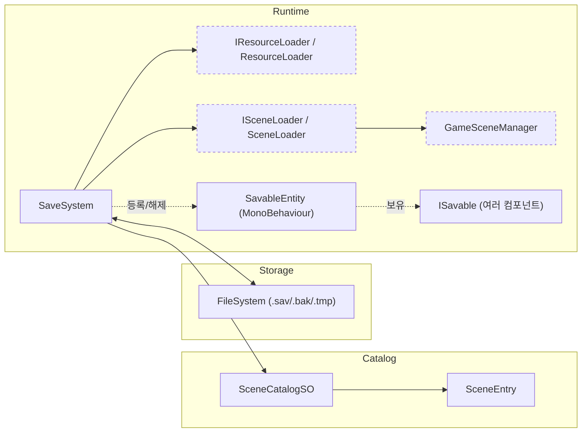
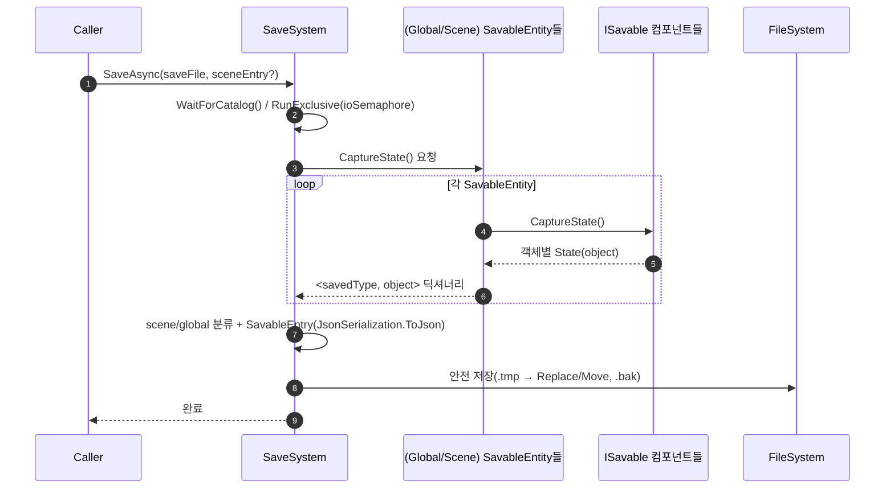
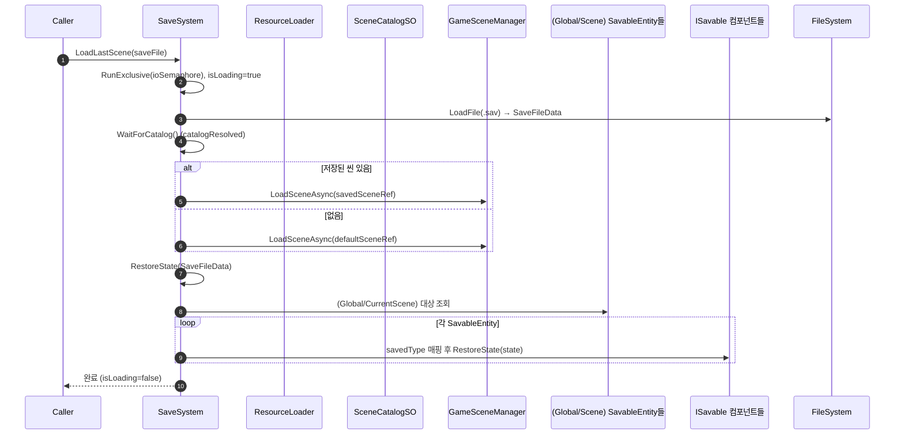
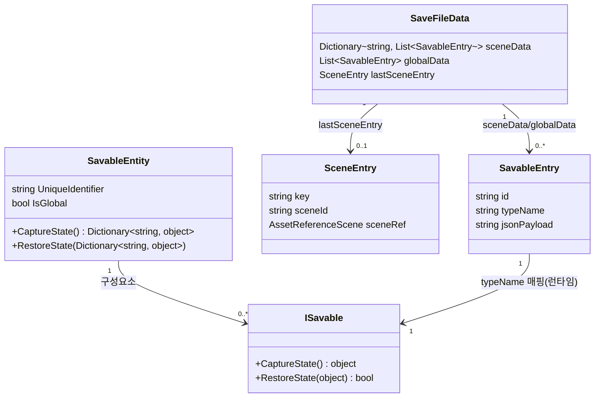

# GameDevPractice

```mermaid
graph LR
  subgraph Runtime
    SS[SaveSystem]
    RL["IResourceLoader / ResourceLoader"]
    SL["ISceneLoader / SceneLoader"]
    GSM[GameSceneManager]
    SE["SavableEntity (MonoBehaviour)"]
    ISV["ISavable (여러 컴포넌트)"]
  end

  subgraph Storage
    FS["FileSystem (.sav/.bak/.tmp)"]
  end

  subgraph Catalog
    SC[SceneCatalogSO]
    CE[SceneEntry]
  end

  SS --> RL:::dep
  SS --> SL:::dep
  SL --> GSM:::dep
  SS -.등록/해제.-> SE
  SE -.보유.-> ISV
  SS --> SC
  SC --> CE
  SS <--> FS

  classDef dep stroke-dasharray: 4 4;

```

```mermaid
sequenceDiagram
  autonumber
  participant Caller
  participant SS as SaveSystem
  participant SEM as (Global/Scene) SavableEntity들
  participant ISV as ISavable 컴포넌트들
  participant FS as FileSystem

  Caller->>SS: SaveAsync(saveFile, sceneEntry?)
  SS->>SS: WaitForCatalog() / RunExclusive(ioSemaphore)
  SS->>SEM: CaptureState() 요청
  loop 각 SavableEntity
    SEM->>ISV: CaptureState()
    ISV-->>SEM: 객체별 State(object)
    SEM-->>SS: <savedType, object> 딕셔너리
  end
  SS->>SS: scene/global 분류 + SavableEntry(JsonSerialization.ToJson)
  SS->>FS: 안전 저장(.tmp → Replace/Move, .bak)
  SS-->>Caller: 완료

```

```mermaid
sequenceDiagram
  autonumber
  participant Caller
  participant SS as SaveSystem
  participant RL as ResourceLoader
  participant SC as SceneCatalogSO
  participant GSM as GameSceneManager
  participant SEM as (Global/Scene) SavableEntity들
  participant ISV as ISavable 컴포넌트들
  participant FS as FileSystem

  Caller->>SS: LoadLastScene(saveFile)
  SS->>SS: RunExclusive(ioSemaphore), isLoading=true
  SS->>FS: LoadFile(.sav) → SaveFileData
  SS->>SS: WaitForCatalog() (catalogResolved)
  alt 저장된 씬 있음
    SS->>GSM: LoadSceneAsync(savedSceneRef)
  else 없음
    SS->>GSM: LoadSceneAsync(defaultSceneRef)
  end
  SS->>SS: RestoreState(SaveFileData)
  SS->>SEM: (Global/CurrentScene) 대상 조회
  loop 각 SavableEntity
    SS->>ISV: savedType 매핑 후 RestoreState(state)
  end
  SS-->>Caller: 완료 (isLoading=false)

```

```mermaid
classDiagram
  class SaveFileData {
    Dictionary~string, List~SavableEntry~~ sceneData
    List~SavableEntry~ globalData
    SceneEntry lastSceneEntry
  }

  class SavableEntry {
    string id
    string typeName
    string jsonPayload
  }

  class SceneEntry {
    string key
    string sceneId
    AssetReferenceScene sceneRef
  }

  class SavableEntity {
    string UniqueIdentifier
    bool IsGlobal
    +CaptureState() Dictionary~string, object~
    +RestoreState(Dictionary~string, object~)
  }

  class ISavable {
    +CaptureState() object
    +RestoreState(object) bool
  }

  SaveFileData "1" --> "0..*" SavableEntry : sceneData/globalData
  SaveFileData "1" --> "0..1" SceneEntry : lastSceneEntry
  SavableEntity "1" --> "0..*" ISavable : 구성요소
  SavableEntry "1" --> "1" ISavable : typeName 매핑(런타임)

```
